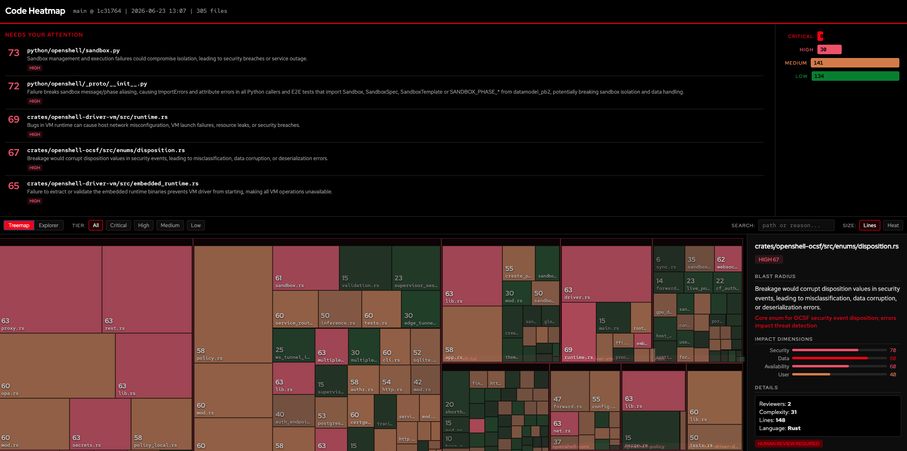
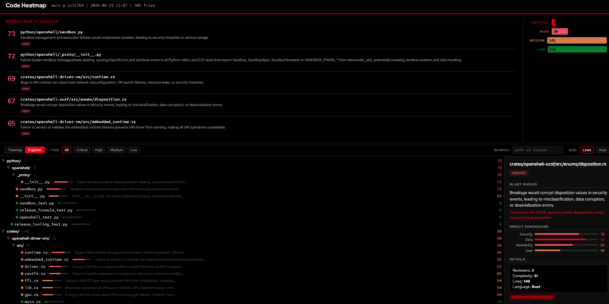

<p align="center">
  <br>
  
  <br>
  <em>305 files analyzed. 30 need your attention. The rest are safe to auto-review.</em>
  <br>
  <br>
</p>

<h1 align="center">Code Heatmap</h1>

<p align="center">
  <strong>Know which code would hurt the most if it broke.</strong>
  <br>
  LLM-assisted blast radius analysis for every file in your repo.
  <br>
  <br>
  <a href="#quick-start">Quick Start</a> ·
  <a href="#how-it-works">How It Works</a> ·
  <a href="#commands">Commands</a> ·
  <a href="#models">Models</a>
</p>

Point it at any codebase. In under 2 minutes, you know:

- **Where to focus**: "sandbox.py handles isolation. Breakage causes container escapes." (score: 73, HIGH)
- **What's safe**: "theme.rs sets terminal colors. Breakage causes cosmetic issues." (score: 6, LOW)
- **What to do**: 2 senior reviewers + security scan, or auto-merge OK

Static analysis alone can't do this. A complexity counter sees `auth.rs` and `theme.rs` as "both Rust files." The LLM reads the code and understands that one is a security boundary and the other formats colors.

## Quick Start

**1.** Install and set up:

```sh
go install github.com/zanetworker/code-heatmap/cmd/heatmap@latest
export OPENROUTER_API_KEY="sk-or-..."
```

**2.** Analyze:

```sh
cd /path/to/repo
heatmap init && heatmap analyze
```

```
Heatmap generated: .heatmap/heatmap.json (305 files)

Heat Distribution:
  🔥🔥🔥 CRITICAL: 0 files
  🔥🔥  HIGH:     30 files
  🔥   MEDIUM:   141 files
  🟢   LOW:      134 files
```

**3.** See results:

```sh
heatmap dashboard     # Visual treemap + file explorer (opens browser)
heatmap               # Terminal TUI
heatmap list --tier high
```

## Dashboard

Two views, one detail panel. Click any file to see blast radius reasoning, impact dimensions, and review requirements.

**Treemap** — blocks sized by code volume, colored by heat. Your eye goes to the big red blocks first.

**Explorer** — collapsible file tree sorted hottest-first, with heat bars and reasoning inline.

<p align="center">
  
</p>

Both views respond to tier filters (Critical / High / Medium / Low), search, and size toggle (Lines vs Heat).

## How It Works

1. **Static analysis** scans every source file for complexity, dependency centrality, import graph
2. **Git analysis** measures change frequency, contributor count, commit patterns
3. **LLM assessment** sends each file to an LLM: *"if this code has a bug, what breaks?"*
4. **Scoring** combines LLM blast radius (40%) with static signals into a 0-100 heat score
5. **Tiering** maps scores to review requirements

The LLM returns structured scores across four dimensions:

| Dimension | What It Measures |
|-----------|-----------------|
| **Security** | Auth boundaries, crypto, sandbox isolation, access control |
| **Data** | PII handling, persistence, data integrity, schema |
| **Availability** | Service lifecycle, infrastructure, single points of failure |
| **User** | User-facing paths, API contracts, UX-critical flows |

### Scoring Weights

| Factor | Weight | Source |
|--------|--------|--------|
| **LLM Blast Radius** | **40%** | Max of four impact dimensions |
| Dependency Centrality | 15% | Import graph analysis |
| Complexity | 15% | Cyclomatic + cognitive |
| Test Coverage Risk | 10% | Inverse of coverage |
| Incident History | 10% | Manual records |
| Change Frequency | 10% | Git churn |

### Tier System

| Tier | Score | Review Required |
|------|-------|-----------------|
| 🔥🔥🔥 **CRITICAL** | 86-100 | 2 senior reviewers + security scan |
| 🔥🔥 **HIGH** | 61-85 | 2 reviewers + integration tests |
| 🔥 **MEDIUM** | 31-60 | 1 reviewer |
| 🟢 **LOW** | 0-30 | Auto-review safe |

## Commands

### Analyze

```sh
heatmap init                                         # Create .heatmap/ config
heatmap analyze                                      # Full LLM analysis (~$0.15)
heatmap analyze --model z-ai/glm-5.2                 # Different model
heatmap analyze --no-llm                             # Static only, no API key
```

### Visualize

```sh
heatmap dashboard                                    # HTML dashboard (browser)
heatmap                                              # Terminal TUI
```

### Query

```sh
heatmap get <file>                                   # Score + reasoning
heatmap list --tier high --limit 10                  # Filter files
heatmap report                                       # Distribution report
```

All commands support `--json` for machine-readable output.

<details><summary><b>Example: heatmap get</b></summary>

```
$ heatmap get python/openshell/sandbox.py

python/openshell/sandbox.py  🔥🔥 HIGH  (score: 73)

Blast Radius (LLM-assessed):
  Sandbox management and execution failures could compromise
  isolation, leading to security breaches or service outage.
  Reason: Sandbox isolation is a security boundary.
  Security: 95  Data: 90  Availability: 90  User: 90

Risk Factors:
  Dependency Centrality:  8 (1 imports)
  Change Frequency:       0 (0 commits/90d)
  Complexity:             100 (cyclomatic: 53)

Review: 2 reviewers, ~45 min, auto-merge blocked
```

</details>

<details><summary><b>Example: heatmap list --tier high</b></summary>

```
$ heatmap list --tier high --limit 5

🔥🔥  73  python/openshell/sandbox.py       Sandbox isolation breach risk
🔥🔥  72  python/openshell/_proto/...       Import failures in security-critical logic
🔥🔥  69  crates/.../runtime.rs             Host network misconfiguration, VM failures
🔥🔥  67  crates/.../disposition.rs         Corrupted security event values
🔥🔥  65  crates/.../embedded_runtime.rs    Complete loss of VM functionality
```

</details>

### PR Risk

```sh
heatmap pr check                                     # Score diff vs main
heatmap pr check --base dev --json                   # For CI pipelines
```

### Incidents

```sh
heatmap incident create --file src/auth.rs \
  --severity high --description "Token bypass"
heatmap incident list
```

### GitHub Action

```sh
heatmap github install
```

Posts a risk comment on every PR with file scores and review requirements.

### Agent Introspection

```sh
heatmap agent-context
```

Machine-readable JSON of all commands, flags, exit codes, and models. Built for AI agents to discover the CLI surface programmatically.

## Models

One [OpenRouter](https://openrouter.ai) API key, any model. Assessments cached by content hash; re-runs only re-assess changed files.

| Model | Cost / 500 files | Best For |
|-------|-----------------|----------|
| `deepseek/deepseek-v4-flash` | **~$0.15** | Default, cheapest |
| `deepseek/deepseek-v4-pro` | ~$0.50 | Best accuracy/dollar |
| `z-ai/glm-5.2` | ~$3-5 | Frontier open-weights |
| `openai/gpt-5.4-mini` | ~$0.90 | Safest JSON |
| `google/gemini-3-flash` | ~$0.50 | Fastest |

## Exit Codes

| Code | Meaning |
|------|---------|
| `0` | Success |
| `1` | Internal error |
| `2` | Invalid input |
| `3` | External dependency failure |
| `4` | Not found |

## Requirements

- Go 1.25+
- Git
- `OPENROUTER_API_KEY` (optional with `--no-llm`)

## Related

- [Agentic Code Review](https://addyo.substack.com/p/agentic-code-review) by Addy Osmani
- [Semantically-Seeded Impact Analysis](https://arxiv.org/abs/2606.18855) (Jun 2026)
- [BitsAI-CR: Two-Stage Code Review at ByteDance](https://arxiv.org/abs/2501.15134)
- [c-CRAB: Code Review Agent Benchmark](https://arxiv.org/abs/2603.23448)
- [OpenSSF Criticality Score](https://openssf.org/projects/criticality-score/)

## License

MIT
