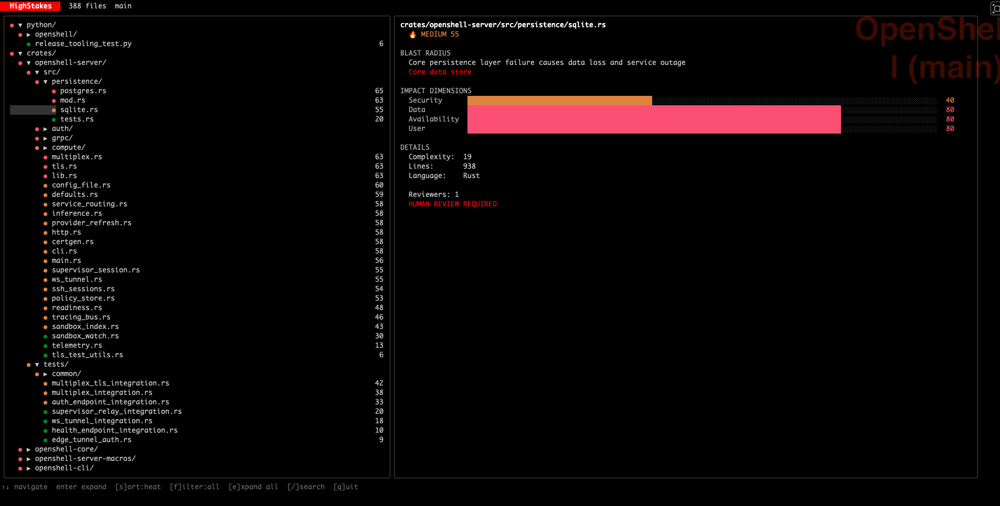

<p style="font-size: 1.3em; color: #666; margin-bottom: 2em;">
Know which code would hurt the most if it broke.
</p>

HighStakes combines static analysis with LLM blast radius assessment to score every file in your repo. It tells you where human review is needed and where AI can handle the rest.


## Quick start

```sh
go install github.com/zanetworker/highstakes/cmd/highstakes@latest
export OPENROUTER_API_KEY="sk-or-..."

cd /path/to/repo
highstakes init && highstakes analyze
highstakes dashboard
```

## How it works

1. **Static analysis** scans complexity, dependency graph, and import structure
2. **Git analysis** measures change frequency and contributor patterns
3. **LLM assessment** reads each file and asks "if this breaks, what's the damage?"
4. **Scoring** combines all signals into a 0-100 heat score per file
5. **Tiering** maps scores to concrete review requirements

| Tier | Score | Review |
|------|-------|--------|
| CRITICAL | 86-100 | 2 senior reviewers + security scan |
| HIGH | 61-85 | 2 reviewers + integration tests |
| MEDIUM | 31-60 | 1 reviewer |
| LOW | 0-30 | Auto-merge safe |

## Three ways to see it

**Dashboard** with treemap and file explorer:

```sh
highstakes dashboard
```

**Terminal TUI** with keyboard navigation:



**CLI** with JSON output for CI:

```sh
highstakes list --tier high --json
highstakes get src/auth/oidc.rs
highstakes pr check --base main --json
```

## Works with any model

Any OpenAI-compatible endpoint. No vendor lock-in.

| Setup | Cost | Data stays |
|-------|------|-----------|
| OpenRouter | $0.15/repo | Cloud |
| Self-hosted vLLM on OpenShift AI | Free | On-prem |
| Local Ollama | Free | Your laptop |

```sh
# Cloud
export OPENROUTER_API_KEY="sk-or-..."

# Self-hosted
export HIGHSTAKES_API_KEY="$(oc whoami -t)"
export HIGHSTAKES_API_URL="https://your-model.apps.cluster.dev/v1/chat/completions"

# Local
export HIGHSTAKES_API_KEY="ollama"
export HIGHSTAKES_API_URL="http://localhost:11434/v1/chat/completions"
```

## Documentation

- [Getting started](getting-started.md)
- [Configuration](configuration.md)
- [CI integration](ci-integration.md)
- [CLI reference](cli-reference.md)
- [How it works](how-it-works.md)

## Links

- [GitHub repo](https://github.com/zanetworker/highstakes)
- [Blog post](https://adelzaalouk.me/2026/Jun/25/your-code-review-process-is-already-broken)
